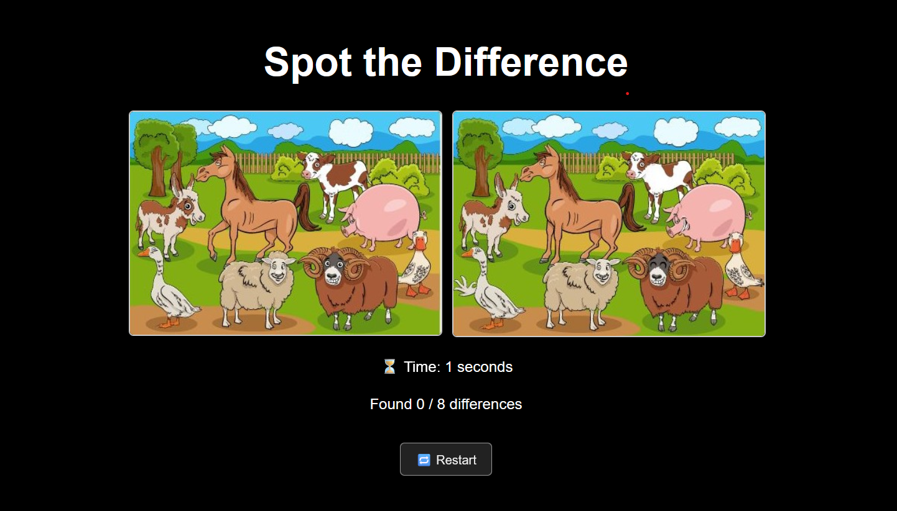

# 🐮 Spot the Difference –  Animals

A fun and interactive "Spot the Difference" game built using **React + Vite**, where players find hidden differences between two similar images of farm animals.

---

## 📸 Preview




---

---

## ▶️ How to Run the Game

### 🔧 Prerequisites

- npm or yarn

### 📦 Install and Launch

```bash
# 1. Clone the repository
git clone https://github.com/DEVJDR/spotDifference.git
cd spot-difference-game

# 2. Install dependencies
npm install

# 3. Start the development server
npm run dev
---


##  Spot the Difference

{
  "gameTitle": "Spot the Difference - Farm Animals",
  "images": {
    "image1": "/image1.png",
    "image2": "/image2.png"
  },
  "differences": [
    {
      "x": 120,
      "y": 90,
      "width": 30,
      "height": 30
    },
    {
      "x": 260,
      "y": 110,
      "width": 30,
      "height": 40
    }
    // ...more
  ]
}

The game relies entirely on the game-config.json file to control its behavior. This makes it easily customizable without touching the JavaScript code. Here’s how it's used:
🔹 1. Image Paths

The JSON contains the paths to the two images shown side by side:

"images": {
  "image1": "/image1.png",
  "image2": "/image2.png"
}

These images are loaded dynamically by the React app, so you can swap them with any other pair by simply updating these paths.
🔹 2. Defining Differences

The differences array defines all the hotspot areas (differences) on the image using:

    x – X-coordinate of the difference zone.

    y – Y-coordinate of the difference zone.

    width and height – The size of the clickable area.

Example:

{
  "x": 260,
  "y": 110,
  "width": 30,
  "height": 40
}

The player must click inside this box (on either image) to successfully spot the difference. When clicked correctly:

    A green circle appears.

    A sound is played.

    The score is updated.

    If all differences are found, a popup is shown with the completion time.
